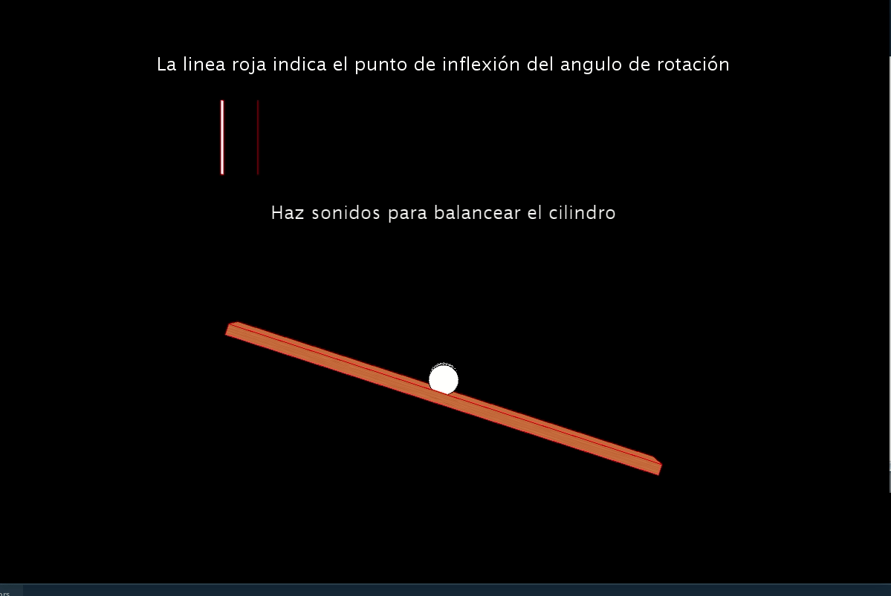

# Uso de la voz como interfaz de usuario

## Sobre el Autor

> **Miguel Lincoln Capote Pratts** - Universidad de Las Palmas de Gran Canaria [**ULPGC**](https://www.ulpgc.es).

## Desarrollo

Se trata de un juego de equilibrio donde se debe de mantener el cilindro en la barra haciendo uso de la voz de usuario, esto implica que 
 el usuario utilice el micrófono. En la barra blanca superior se muestra el volumen actual, la linea roja indicaría que el angulo de rotación es 0. Si el usuario no habla la barra rota en el sentido del reloj y si pasa de la barra roja pasa lo contrario.

Se encontraron dificultades a la hora de simular las físicas del equilibrio, se optó por una solución más sencilla ya que siendo un prototipo no se vio necesario invertir tanto tiempo en la implementación.

## Referencias y Librerías utilizadas

Se desarrollo
 utilizando como referencia la página oficial de processing. 

